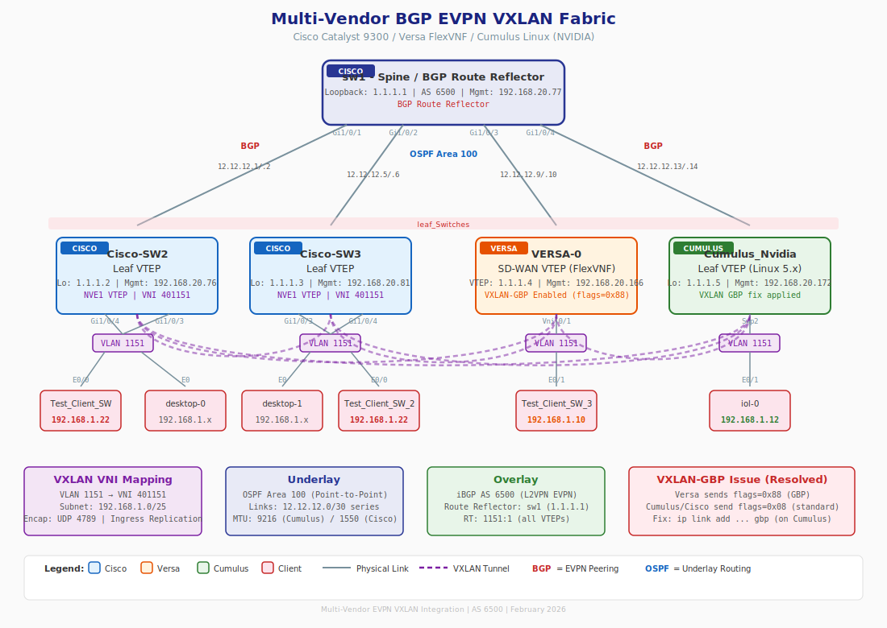

# Multi-Vendor EVPN VXLAN Fabric: Cisco / Versa / Cumulus

A multi-vendor BGP EVPN VXLAN fabric integrating **Cisco Catalyst 9300**, **Versa FlexVNF SD-WAN**, and **Cumulus Linux (NVIDIA)** switches for Layer 2 extension across heterogeneous network equipment.

## Topology Overview



### ASCII Diagram

```
                           +---------------------------+
                           |   sw1 - Spine / BGP RR    |
                           |   Catalyst 9300           |
                           |   Loopback: 1.1.1.1       |
                           +--+------+------+------+---+
                              |      |      |      |
                           Gi1/0/1 Gi1/0/2 Gi1/0/3 Gi1/0/4
                              |      |      |      |
              +---------------+      |      |      +------------------+
              |                      |      |                         |
    +---------+----------+  +--------+-------+  +---------+----------+  +----------+---------+
    |  sw2 - Leaf VTEP   |  | sw3 - Leaf VTEP|  |  VERSA FlexVNF    |  | Cumulus_Nvidia      |
    |  Catalyst 9300     |  | Catalyst 9300  |  |  SD-WAN VTEP      |  | Cumulus Linux 5.x   |
    |  Lo: 1.1.1.2       |  | Lo: 1.1.1.3   |  |  VTEP: 1.1.1.4    |  | Lo: 1.1.1.5         |
    +---------+----------+  +--------+-------+  +---------+----------+  +----------+---------+
              |                      |                     |                         |
         VLAN 1151              VLAN 1151             VLAN 1151                 VLAN 1151
              |                      |                     |                         |
       Test_Client_SW        Test_Client_SW_2      Test_Client_SW_3             iol-0
       192.168.1.22          192.168.1.22          192.168.1.10               192.168.1.12
```

## Network Details

| Component | Value |
|-----------|-------|
| BGP AS (Fabric) | 6500 |
| BGP AS (External) | 6505 |
| Underlay Protocol | OSPF Area 100 |
| Overlay Protocol | BGP EVPN (iBGP with Route Reflector) |
| VRF | VRF-1 (RD: 10:1101) |
| VXLAN Encap | UDP 4789, Ingress Replication |

## Device Inventory

| Device | Role | Platform | Loopback/VTEP | Mgmt IP |
|--------|------|----------|---------------|---------|
| sw1 | Spine / BGP Route Reflector | Catalyst 9300 | 1.1.1.1 | 192.168.20.77 |
| sw2 | Leaf VTEP | Catalyst 9300 | 1.1.1.2 | 192.168.20.76 |
| sw3 | Leaf VTEP | Catalyst 9300 | 1.1.1.3 | 192.168.20.81 |
| Versa FlexVNF | SD-WAN VTEP | FlexVNF 22.1.4 | 1.1.1.4 | 192.168.20.166 |
| Cumulus_Nvidia | Leaf VTEP | Cumulus Linux 5.x | 1.1.1.5 | 192.168.20.172 |

## VLANs and VNI Mapping

| VLAN | Name | VNI | Subnet | Devices |
|------|------|-----|--------|---------|
| 1101 | VRF1_CORE_VLAN | 50101 | - | sw2, sw3 (L3VNI) |
| **1151** | **VRF1_ACCESS_VLAN** | **401151** | **192.168.1.0/25** | **sw2, sw3, Versa, Cumulus** |
| 1152 | VRF1_ACCESS_VLAN_2 | 401152 | 192.168.2.0/25 | sw2, sw3 |
| 1153 | VRF1_ACCESS_VLAN_3 | 401153 | 192.168.3.0/25 | sw2, sw3 |

## Configuration Guides

### Cisco Catalyst 9300 (Step-by-Step)

1. [Step 1: Base Configuration](docs/01-base-config.md) - Hostname, Loopbacks, IP routing
2. [Step 2: Underlay (OSPF)](docs/02-underlay-ospf.md) - OSPF configuration for reachability
3. [Step 3: BGP EVPN Overlay](docs/03-bgp-evpn-overlay.md) - BGP configuration for EVPN
4. [Step 4: VRF Configuration](docs/04-vrf-config.md) - VRF definition with route targets
5. [Step 5: VLAN and VNI Mapping](docs/05-vlan-vni-mapping.md) - VLAN to VNI association
6. [Step 6: L2VPN EVPN Instance](docs/06-l2vpn-evpn-instance.md) - EVPN instance configuration
7. [Step 7: NVE Interface](docs/07-nve-interface.md) - VXLAN tunnel endpoint
8. [Step 8: SVI Configuration](docs/08-svi-config.md) - VLAN interfaces for routing
9. [Step 9: Verification Commands](docs/09-verification.md) - Show commands to verify setup
10. [Step 10: Live Verification Output](docs/10-verification-output.md) - Actual output from running fabric

### Multi-Vendor Integration

11. [Step 11: Versa FlexVNF Integration](docs/11-versa-integration.md) - Versa SD-WAN EVPN peering
12. [Step 12: Cumulus Linux (NVIDIA) Integration](docs/12-cumulus-integration.md) - Cumulus NVUE EVPN configuration
13. [Full Integration Guide (HTML)](docs/Versa-Cisco-EVPN-VXLAN-Integration.html) - Comprehensive multi-vendor guide with GBP analysis

## VXLAN-GBP Interoperability Issue

During integration testing, a critical interoperability issue was discovered with **VXLAN-GBP (Group Based Policy) extended headers**. Multiple vendors send VXLAN packets with GBP flags (0x88 instead of standard 0x08):

- **Cisco Catalyst 9300** with `group-based-policy` + CTS/SGT enabled sends flags=0x88 with SGT tag in the Group Policy ID field
- **Versa FlexVNF** sends flags=0x88 by default (GBP always enabled)

The Linux kernel VXLAN driver (used by Cumulus Linux, Ubuntu, and other Linux-based network OS) **silently drops** GBP-flagged packets unless the VXLAN interface is created with the `gbp` option. This is **not a vendor-specific issue** — it affects any VTEP that sends VXLAN-GBP extended headers to a Linux-based receiver.

**Symptoms:** 100% data plane packet loss between GBP-sending VTEP and Linux-based VTEP, despite EVPN control plane being fully operational (BGP sessions up, routes exchanged, NVE peers visible).

**Affected traffic flows:**
- Cisco (GBP ON) → Cumulus: **DROPPED** (without `gbp` flag on Cumulus)
- Versa → Cumulus: **DROPPED** (without `gbp` flag on Cumulus)
- Cisco (GBP OFF) → Cumulus: Works fine (standard 0x08 flags)

**Resolution:** Recreate the VXLAN interface on Cumulus/Linux with `gbp` flag:
```bash
sudo ip link add vxlan48 type vxlan id 401151 local 1.1.1.5 dstport 4789 nolearning gbp
```

**Root Cause:** The Linux kernel VXLAN driver validates the flags byte. When it receives a packet with G-bit set (0x88) but the local VXLAN interface was not created with `gbp`, the kernel considers the header invalid and drops the packet silently — no log message, no counter increment.

See [VXLAN-GBP Analysis Report](VXLAN_GBP_Analysis_Report.md) for full packet capture analysis with hex dump evidence from all four VTEPs.

## Cumulus Linux Quick Config (NVUE)

```bash
# Loopback and underlay
nv set interface lo ip address 1.1.1.5/32
nv set interface swp1 ip address 12.12.12.14/30
nv set interface swp1 router ospf enable on
nv set interface swp1 router ospf area 100
nv set interface swp1 router ospf network-type point-to-point

# BGP EVPN
nv set router bgp autonomous-system 6500
nv set vrf default router bgp neighbor 1.1.1.1 remote-as internal
nv set vrf default router bgp neighbor 1.1.1.1 update-source lo
nv set vrf default router bgp address-family l2vpn-evpn enable on

# VXLAN + VLAN 1151
nv set nve vxlan enable on
nv set nve vxlan source address 1.1.1.5
nv set bridge domain br_default vlan 1151 vni 401151
nv set evpn vni 401151 route-target export 1151:1
nv set evpn vni 401151 route-target import 1151:1

nv config apply -y
```

## Device Configurations

Complete running configurations are available in the [configs/](configs/) directory:

- [sw1 (Spine/RR)](configs/sw1.cfg)
- [sw2 (Leaf)](configs/sw2.cfg)
- [sw3 (Leaf)](configs/sw3.cfg)
- [External_Router_1](configs/external_router_1.cfg)

## Requirements

- Cisco Catalyst 9000 Series (IOS-XE 17.x+, DNA Advantage license)
- Versa FlexVNF 22.1.4+
- Cumulus Linux 5.x (NVUE)

## Repository Rename

This repository was previously named `EVPN-VXLAN-on-Catalyst-9K`. It has been expanded to cover multi-vendor EVPN VXLAN integration with Cisco, Versa, and Cumulus.

## About This Project

This documentation was created with the assistance of [Claude Code](https://claude.ai/claude-code) (Anthropic's AI coding assistant).

### What Claude Code Did:
- Connected to live network devices (Cisco, Versa, Cumulus) via SSH using Python paramiko
- Configured OSPF underlay, BGP EVPN overlay, and VXLAN on Cumulus switch
- Diagnosed and resolved VXLAN-GBP interoperability issue using tcpdump and pcap analysis
- Generated comprehensive documentation with packet-level evidence

### Author
- GitHub: [@Enizaksoy](https://github.com/Enizaksoy)

## References

- [Cisco EVPN VXLAN Configuration Guide](https://www.cisco.com/c/en/us/td/docs/switches/lan/catalyst9000/software/release/17-x/configuration_guide/vxlan/b_17x_vxlan_9k_cg.html)
- [Cumulus Linux NVUE Documentation](https://docs.nvidia.com/networking-ethernet-software/cumulus-linux/)
- [VXLAN-GBP Draft (draft-smith-vxlan-group-policy)](https://datatracker.ietf.org/doc/draft-smith-vxlan-group-policy/)
